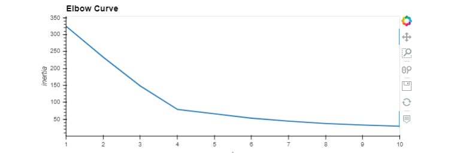
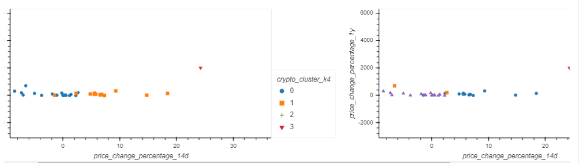

# Crypto market
In this project we are assembling investment portfolios that are based on cryptocurrencies. Instead of basing out of only returns and volatility, this includes other factors that might impact the crypto market—leading to better performance for your portfolio.


## Technologies

This project leverages python 3.7 with the following packages:

* [Pandas](https://pandas.pydata.org/) - For data cleaning, preparation and manipulation

* [Jupyter Notebook](https://jupyter.org/) - An open-source web application that allows you to create and share documents that contain live code, equations, visualizations and narrative text.

* [Visual Studio Code](https://code.visualstudio.com/) - A code editor redefined and optimized for building and debugging modern web and cloud applications

## Installation Guide

Download Anaconda for your operating system and the latest Python version, run the installer, and follow the steps.

Before running the application first install the following dependencies.

```python

import pandas as pd
import hvplot.pandas
from path import Path
from sklearn.cluster import KMeans
from sklearn.decomposition import PCA
from sklearn.preprocessing import StandardScaler

To install PyViz and its dependencies in your Conda dev environment, complete the following steps:

1. From your terminal, log in to your Conda dev environment.
.
2. Install the PyViz packages by using the conda install command as follows:
    
	conda install -c plotly plotly=4.13.
    
    conda install -c pyviz hvplot
-----------------------------------------------------------------------------------------------------------------------------------------------------

## Usage

As per the Elbow curve, K=4 seems to be a good model . 




----------------------------------------------------------------------------------------------------------------------------------------------------

We developed two models using cluster k=4 and K=5. The plot on the left is created using k=4 and plot on right using k=5



-----------------------------------------------------------------------------------------------------------------------------------------------------
Analysis - K = 4 seems good, because in elbow curve that was an optimum number. Also, when K=5, the groups are overlapped with each other and not very segregated in comparision to K=4. Also, since it's the least value between 2 models. Hence, K=4 is better.

..
